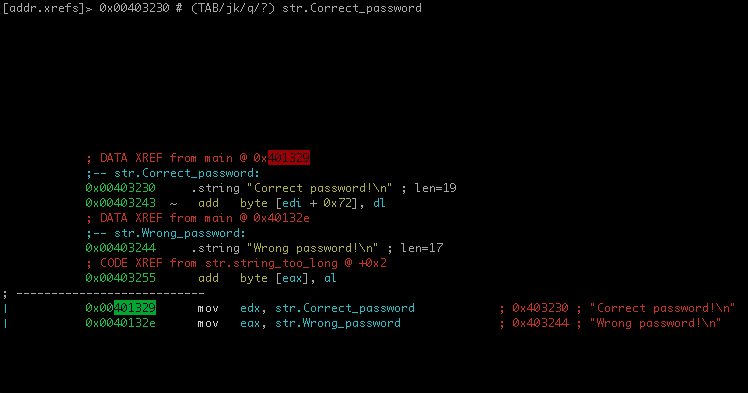
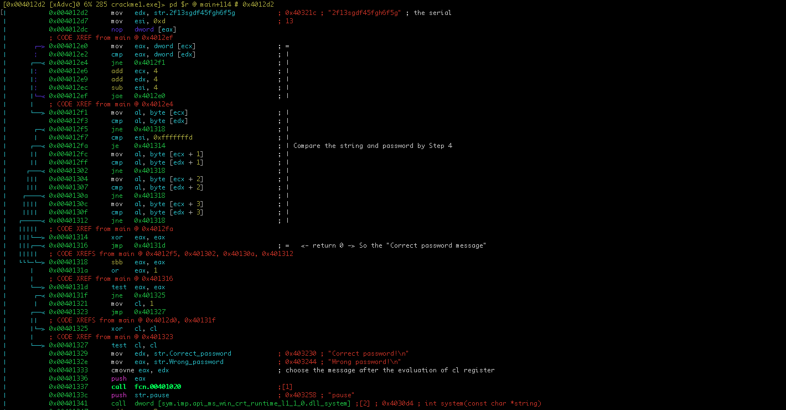
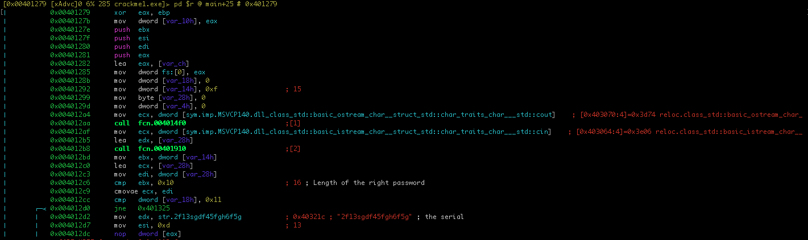
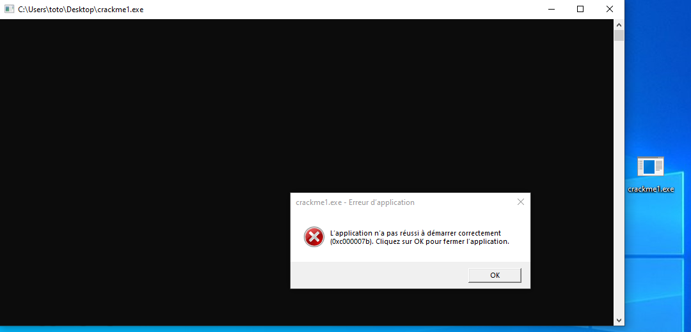

# fufuX's my first crackme solution by mara

URL : https://crackmes.one/crackme/60c50c5d33c5d410b8842da6

## identification

I use rz-bin for this purpose :

```bash
$ rz-bin -I crackme1.exe
Name     Value
--------------
arch     x86
baddr    0x400000
binsz    16384
bintype  pe
bits     32
retguard false
class    PE32
cmp.csum 0x0000cf91
compiled Sat Jun 12 20:20:07 2021
dbg_file C:\Users\NATAEL\source\repos\crackmes\Release\crackme1.pdb
endian   LE
hdr.csum 0x00000000
guid     CB4B6DF360454C59B08EAAC2FF520E091
laddr    0x0
lang     msvc
machine  i386
maxopsz  16
minopsz  1
os       windows
overlay  false
cc       cdecl
pcalign  0
signed   false
subsys   Windows CUI
stripped false
crypto   false
havecode true
va       true
sanitiz  false
static   false
linenum  false
lsyms    false
canary   false
PIE      true
RELROCS  false
NX       true
```

I will show all executable strings to have some clue to valiation check

```bash
$ rz-bin -z crackme1.exe | head -n 15
[Strings]
nth paddr      vaddr      len size section type  string
―――――――――――――――――――――――――――――――――――――――――――――――――――――――
0   0x000021a0 0x004031a0 14  15   .rdata  ascii bad allocation
1   0x000021bc 0x004031bc 17  18   .rdata  ascii Unknown exception
2   0x000021d0 0x004031d0 20  21   .rdata  ascii bad array new length
3   0x000021e8 0x004031e8 15  16   .rdata  ascii string too long
4   0x000021f8 0x004031f8 8   9    .rdata  ascii bad cast
5   0x00002204 0x00403204 22  23   .rdata  ascii What's the password : 
6   0x0000221c 0x0040321c 17  18   .rdata  ascii 2f13sgdf45fgh6f5g
7   0x00002230 0x00403230 18  19   .rdata  ascii Correct password!\n
8   0x00002244 0x00403244 16  17   .rdata  ascii Wrong password!\n
9   0x00002258 0x00403258 5   6    .rdata  ascii pause
10  0x00002558 0x00403558 4   5    .rdata  ascii RSDS
11  0x00002560 0x00403560 4   5    .rdata  ascii E`YL
```

The addresses `0x00403204`, `0x0040321c`, `0x00403230` and `0x00403244`

## analysis

I launching rizin console and I'm seeking to `0x00403230` (Correct password) :

```bash
$ rizin crackme1.exe 
 -- Toggle between disasm and graph with the space key
[0x00401e9e]> aaa
[x] Analyze all flags starting with sym. and entry0 (aa)
[x] Analyze function calls (aac)
[x] Analyze len bytes of instructions for references (aar)
[x] Check for classes
[x] Type matching analysis for all functions (aaft)
[x] Propagate noreturn information
[x] Use -AA or aaaa to perform additional experimental analysis.
[0x00401e9e]> s 0x00403230
[0x00403230]> Vp
```



We can see the code annoted :






The password is **2f13sgdf45fgh6f5g** .

By the way the program won't work and I hope the code is the right code.



## conclusion

Thank you for the challenge and don't forget that's a game. :)

Regards,

2021-06-26 mara

