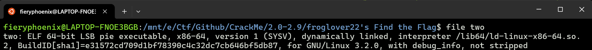
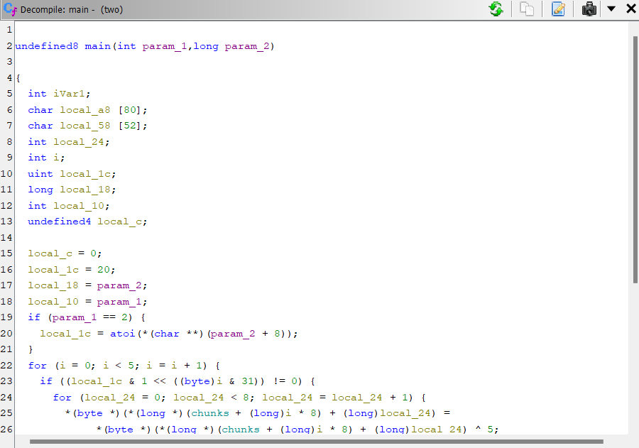
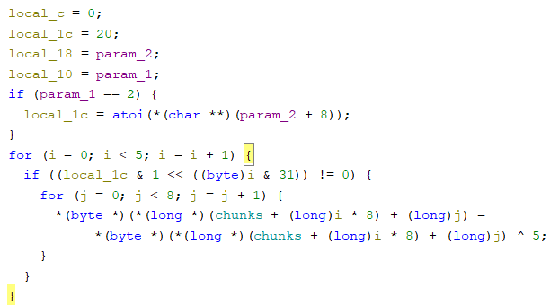

# Crackme Challenge Write-Up

## Challenge Information
**Name:** Leaky pipes

**Category:** Reverse Engineering

**Description:** Find the correct input to reveal the hidden flag

## Tools Used
- **Tool 1:** Ghidra

## Approach and Solution

### Step 1: Overview
The challenge give us a file with no clear format. Check it using file command:



Still not so clear, let's put it in Ghidra, searching for `main` function we get:



There are 5 `chunk` in the snprintf function, let's break down each one of them:
- Chunk1: 6A4627256A6D6660h
- Chunk2: 252476716477626B
- Chunk3: 6F66206576756F59
- Chunk4: 25606D7125616B70
- Chunk5: "flag.\"

My best guess is that the snprinf function will print out the string that we have get the flag. Decode each of the previous 4 chunks and we get:

```
def hex_to_ascii(hex_string):
    ascii_string = bytes.fromhex(hex_string).decode('ascii')
    return ascii_string

# Example usage
Chunks = ["6A4627256A6D6660", "252476716477626B", "6F66206576756F59", "25606D7125616B70"]

for i in Chunks:
    ascii_string = hex_to_ascii(i)
    print(ascii_string)

# `fmj%'Fj
# kbwdqv$%
# Youve fo
# pka%qm`%
```

### Step 2: Function analyze
Let's look deeper into this function:


The first thing we need to note is that `param_1` take 2 inputs, then `local_1c` will take the 2nd param for the loop

The loop basically go throught each of the bytes of `local_1c`, and if `byte & 1 << (i & 31) != 0` then we will do the inner loop. The inner loop takes 8 bytes of the i-th chunk and xor it with 5.

Trying to xor the 4 chunks with 5 and we get:

```
# echo "Co
# ngrats! 
# \jps`%cj
# und the 
# Y+bdic
```

so if we merge the text, we get `echo "Congrats! Youve found the flag.\`. And to achieve that, the `if ((local_1c & 1 << ((byte)i & 31)) != 0)` condition must return =0 -> !=0 -> =0 -> !=0 -> =0. Reverse this and we get `01011`, so we must input a number ending with 01011 and get the flag. (Ex: 11)

**Flag: 11**