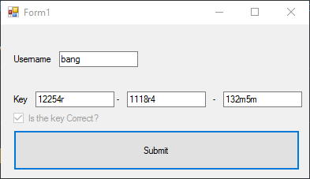
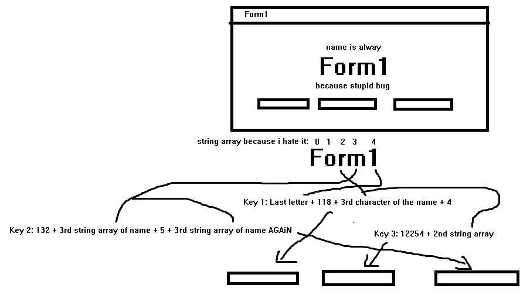
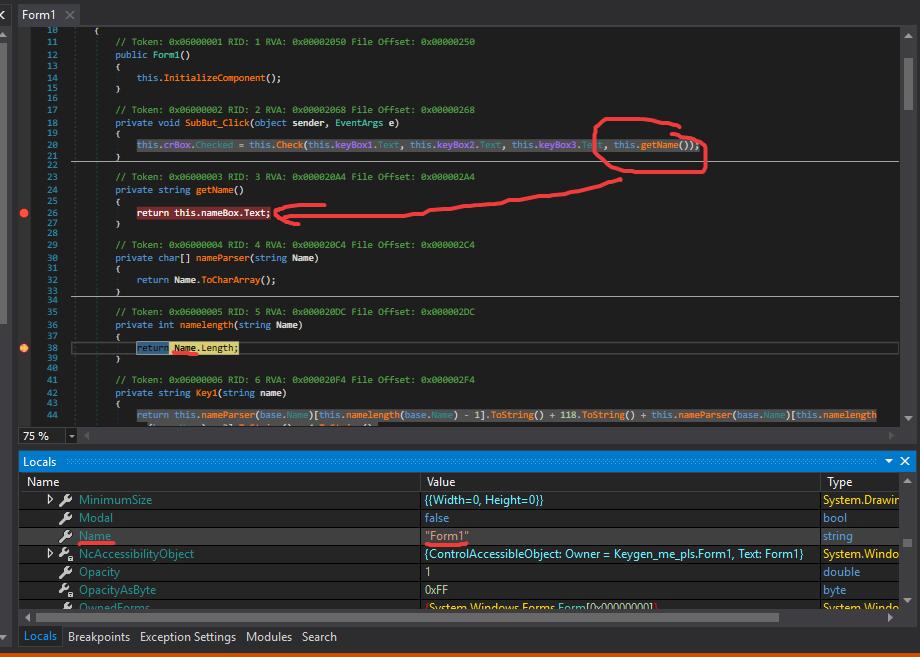
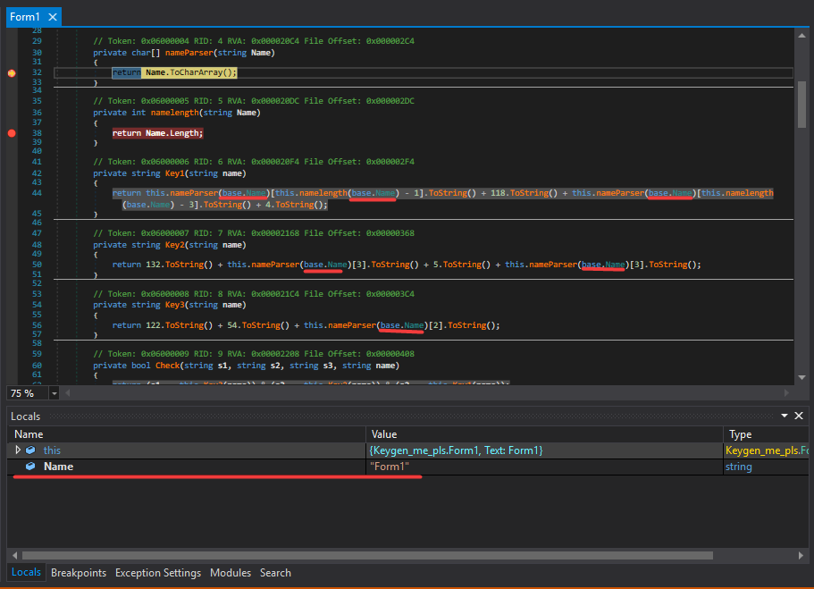
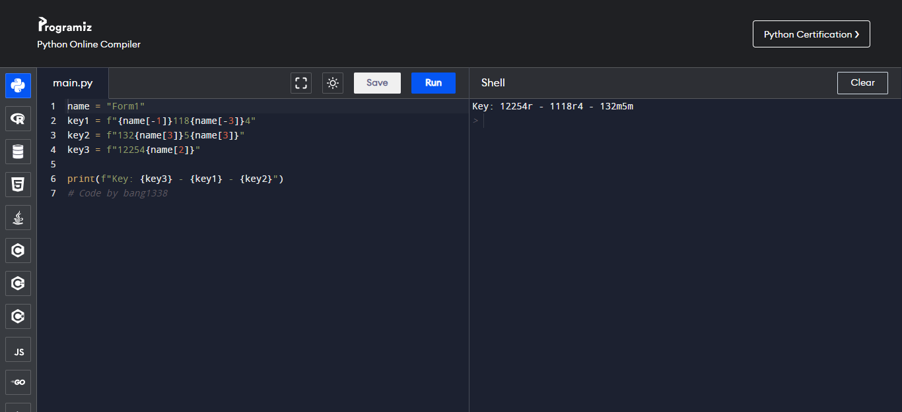
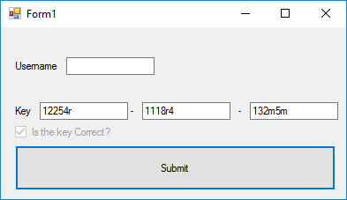

<h1 align="center">
Wiktuur's KeygenMePls
</h1>

<p align="center"> 
  <kbd>

  </kbd>
</p>

<h3 align="center">
Keygenned? by bang1338
</h3>  

- crackmes.one ID: [`6498d4cd33c5d43938913c1e`](https://crackmes.one/crackme/6498d4cd33c5d43938913c1e)

## Challenge
- Put your name and three textbox (which is key)
- If the key ~~along with your name~~ correct, checkbox "Is The Key Correct?" ticked.

## How it processed:
<p align="center"> 
  <kbd>

  </kbd>
</p>  

- This one have a flaw, but I'll tell you later
- I hate string array so...
```
String Order: [1   2   3   4   5]
String:       [F   o   r   m   1]
String Array: [0   1   2   3   4]
```
1. Key 1: Last letter of the name + `118` + 3rd characters of the string.
2. Key 2: `132` + 3rd string array of the name (`name[3]`) + `5` + 3rd string array of the name (`name[3]`), AGAiN
3. Key 3: `12254` + 2rd string array of the name (`name[2]`)
4. Order: Key 1 + Key 3 + Key 2

## The flaw
- Yes, in the code, clearly get name from textbox. But in reality, it take the name of the form instead of your name :v

<p align="center"> 
  <kbd>

  </kbd>
</p> 

<p align="center"> 
  <kbd>

  </kbd>
</p> 

- The `base.Name()` which mean is the form name (aka "Form1"), instead of your name on the textbox. Is that a flaw or a trick? Oh well...

## Solution - Not really keygen...
- With the algorithm we know, we can just name a simple Python script:  
```py
name = "Form1"
key1 = f"{name[-1]}118{name[-3]}4"
key2 = f"132{name[3]}5{name[3]}"
key3 = f"12254{name[2]}"

print(f"Key: {key3} - {key1} - {key2}")
```
- I'm too lazy to run on my machine, so... here's the result:
<p align="center"> 
  <kbd>

  </kbd>
</p> 

- Now we test it...
<p align="center"> 
  <kbd>

  </kbd>
</p> 

- Done, the final key is: `12254r - 1118r4 - 132m5m`.

## Some (final) note
- It's not hard to keygen- i mean finding a key of it.
- This likely trick user into thinking "ha! they use the name for key!", so a flaw happened. It's like "[tự hủy](https://vi.glosbe.com/vi/en/t%E1%BB%B1%20hu%E1%BB%B7)" in coding.
- The flaw is easy to fix... Just use `textbox.Text()` ~~or ask ChatGPT for it~~

## Credit
- Elvis, for cheering :hugs:

## Bonus
I want to patch-fix, but

<p align="center"> 
  <kbd>

  </kbd>
</p>  

## Further note of this
- For god sake please use markdown viewer for reading, recommend GitHub style :v
- I will using crackmes.one ID instead... wait i can just highlight link :v
- I will using image directly instead of using Discord for hosting.


##### bang1338, 2023.